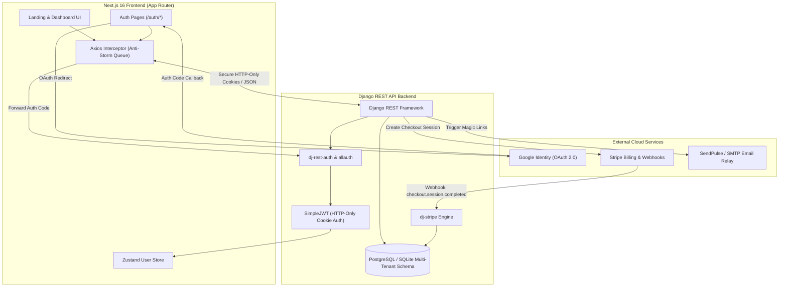

<div align="center">

# 🛡️ Covert SaaS
### **Enterprise Multi-Tenant Architecture & Subscription Platform**

[](https://nextjs.org/)
[](https://react.dev/)
[](https://www.typescriptlang.org/)
[](https://tailwindcss.com/)
[](https://stripe.com/)
[](https://developers.google.com/identity)
[](https://github.com/pmndrs/zustand)
[](https://www.radix-ui.com/)

<p align="center">
  <b>A modern, high-performance Multi-Tenant SaaS boilerplate engineered for rock-solid tenant isolation, complete authentication lifecycles, and automated recurring billing.</b>
</p>

<p align="center">
  <a href="#-key-features">Key Features</a> •
  <a href="#-architecture--data-flow">Architecture</a> •
  <a href="#-tech-stack">Tech Stack</a> •
  <a href="#-authentication--security">Auth & Security</a> •
  <a href="#-payments--stripe-integration">Payments</a> •
  <a href="#-project-structure">Project Structure</a> •
  <a href="#-getting-started">Getting Started</a> •
  <a href="#-environment-variables">Environment</a>
</p>

---

</div>

## 🌟 Overview

**Covert** is an enterprise-grade SaaS web application built with the **Next.js 16 App Router**, **React 19**, and **Tailwind CSS v4**, paired with a secure **Django REST Framework** multi-tenant backend.

Designed from the ground up to solve complex SaaS requirements, it delivers strict tenant schema isolation, automated cookie-based JWT authentication with anti-storm request queueing, Google OAuth 2.0 authorization code flows, transactional email verification links, password recovery workflows, and full-lifecycle Stripe subscription checkout and webhook sync.

---

## ✨ Key Features

### 🔐 Advanced Authentication & User Identity
- **Google OAuth 2.0 Integration**: End-to-end authorization code grant flow with PKCE-compliant callback handlers (`/auth/google/callback`).
- **Magic Verification Links**: Automated activation pipeline with token decoding and verification via transactional email.
- **Self-Service Password Recovery**: Secure tokenized password reset links with real-time field confirmation matching.
- **Silent JWT Refresh Interceptor**: Axios client with queue-based concurrency protection to prevent token refresh storms during expired sessions.
- **Secure Cookie Sessions**: HTTP-Only, SameSite cookie authentication protecting against XSS and CSRF vectors.

### 💳 Stripe Subscription & Billing Engine
- **Tiered SaaS Plans**: Seamless subscription flow for *Starter*, *Pro*, and *Premium/Enterprise* tiers.
- **Stripe Checkout Sessions**: Instant redirect to hosted Stripe Checkout with automated customer association.
- **Active Subscription Detection**: Real-time plan status lookup (`/payments/subscription-status/`) with visual plan badges and icon indicators.
- **Webhook Synchronization**: Backend `dj-stripe` event mapping (`checkout.session.completed`) linking Stripe customer records to tenant profiles.
- **Built-in Test Mode Helper**: Interactive test card banners to accelerate QA and staging verification.

### 🏢 Tenant Isolation & Modern Dashboard
- **Schema-Based Multi-Tenancy**: Data segregated at the architectural level for data sovereignty and compliance.
- **Collapsible Sidebar Layout**: Ergonomic desktop and mobile responsive navigation with active route detection.
- **Account & Profile Management**: Update username, first name, last name, and password with real-time server error feedback.
- **Dynamic Form Validation**: Powered by **React Hook Form** and **Zod** schema schemas, with custom server-side validation error mapping.

### 🎨 Modern UI / UX Design System
- **Next.js 16 + React 19**: Modern concurrent rendering with Turbopack and React Server Components.
- **Tailwind CSS v4 & Radix UI Primitives**: Accessible, customizable UI components (Dialogs, Dropdowns, Navbars, Sheets, Accordions, Tooltips, Badges).
- **Theme Customizer**: Dark/Light mode switching powered by `next-themes` with zero hydration flicker.
- **Toast Notifications**: Modern notifications using `sonner`.

---

## 🏛️ Architecture & Data Flow



---

## 🛠️ Tech Stack

### **Frontend**
| Layer | Technology | Purpose |
| :--- | :--- | :--- |
| **Framework** | [Next.js 16](https://nextjs.org/) | React framework with App Router & Turbopack |
| **Library** | [React 19](https://react.dev/) | Core UI rendering with React 19 Hooks |
| **Language** | [TypeScript 5](https://www.typescriptlang.org/) | Static type safety and strict schema definitions |
| **Styling** | [Tailwind CSS v4](https://tailwindcss.com/) | Next-generation utility-first styling engine |
| **UI Primitives** | [Radix UI](https://www.radix-ui.com/) | Accessible unstyled primitives (Dialog, Dropdown, Nav, Sheet) |
| **State Management**| [Zustand v5](https://github.com/pmndrs/zustand) | Lightweight client state for user sessions |
| **Form Handling** | [React Hook Form](https://react-hook-form.com/) | High-performance form state management |
| **Schema Validation**| [Zod v4](https://zod.dev/) | Type-safe schema validation for inputs & responses |
| **HTTP Client** | [Axios](https://axios-http.com/) | Custom client with 401 refresh concurrency queue |
| **Icons** | [Lucide React](https://lucide.dev/) | Clean, modern iconography |
| **Notifications** | [Sonner](https://sonner.emilkowal.ski/) | Beautiful and customizable toast notifications |
| **Themes** | [next-themes](https://github.com/pacocoursey/next-themes) | Dark / Light theme provider |

### **Backend & Infrastructure**
| Layer | Technology | Purpose |
| :--- | :--- | :--- |
| **API Framework** | [Django REST Framework](https://www.django-rest-framework.org/) | RESTful API endpoints and serializers |
| **Authentication** | [dj-rest-auth](https://dj-rest-auth.readthedocs.io/) + [django-allauth](https://docs.allauth.org/) | Registration, token auth, social auth, password reset |
| **Tokens** | [SimpleJWT](https://django-rest-framework-simplejwt.readthedocs.io/) | Rotating JWT access/refresh tokens in secure cookies |
| **Payments** | [Stripe SDK](https://stripe.com/docs/api) + [dj-stripe](https://dj-stripe.dev/) | Billing sessions, plans, and webhook receivers |
| **Email Relay** | [PySendPulse](https://sendpulse.com/) | Transactional verification & password reset emails |

---

## 🔒 Authentication & Security

### 1. Silent JWT Token Refresh Interceptor
To eliminate token refresh race conditions (where multiple concurrent 401s cause duplicate refresh requests), Covert implements a **promise queue pattern** in `lib/api.ts`:

```typescript
// Prevents token refresh storms on concurrent 401 responses
let isRefreshing = false;
let failedQueue: FailedRequest[] = [];

api.interceptors.response.use(
  (response) => response,
  async (error: AxiosError) => {
    const originalRequest = error.config;
    if (error.response?.status === 401 && !originalRequest._retry) {
      if (isRefreshing) {
        return new Promise((resolve, reject) => {
          failedQueue.push({ resolve, reject });
        }).then(() => api(originalRequest));
      }
      originalRequest._retry = true;
      isRefreshing = true;

      try {
        await axios.post(`${API_BASE}/dj-rest-auth/token/refresh/`, {}, { withCredentials: true });
        processQueue(null);
        return api(originalRequest);
      } catch (err) {
        processQueue(err);
        window.location.href = "/auth/login";
      } finally {
        isRefreshing = false;
      }
    }
    return Promise.reject(error);
  }
);
```

### 2. Authentication Flows Supported
- **Standard Signup & Signin**: Username, email, and password validation with automated session creation.
- **Email Activation**: Account activation via signed tokens (`/auth/signup/activate/[token]`).
- **Google OAuth2 Login**: Single sign-on using Google OAuth2 with authorization code exchange.
- **Password Reset Journey**:
  1. User requests reset at `/auth/forgot-password`.
  2. Transactional email with `uid` and `token` is dispatched.
  3. Reset confirmed and updated at `/auth/forgot-password/confirm/[uid]/[token]`.

---

## 💳 Payments & Stripe Integration

```
User Selects Plan  ───>  POST /payments/create-checkout-session/
                                     │
                                     ▼
                          Stripe Hosted Checkout
                                     │
              ┌──────────────────────┴──────────────────────┐
              ▼                                             ▼
       [Success URL]                                   [Cancel URL]
 /dashboard/plan/activated                      /dashboard/plan/cancelled
              │
              ▼
   Stripe Webhook Dispatched
 (checkout.session.completed)
              │
              ▼
 dj-stripe updates Subscription & Maps Customer to Tenant
```

- **Subscription Status Hook**: Instant lookup of active tier (`Basic`, `Pro`, `Premium`).
- **Customer Portal**: Direct management of billing details, payment methods, and invoices.
- **Integrated Test Credentials**: Built-in test card notifications directly on the plan selection screen.

---

## 📁 Project Structure

```
tenant-saas/
├── app/                                # Next.js 16 App Router
│   ├── auth/                           # Authentication route group
│   │   ├── forgot-password/            # Password recovery pages & confirm
│   │   │   ├── confirm/[...data]/      # Token & UID confirmation handler
│   │   │   └── emailsent/              # Password email dispatched banner
│   │   ├── google/callback/            # Google OAuth 2.0 code exchange
│   │   ├── login/                      # User login page
│   │   └── signup/                     # Registration & verification
│   │       ├── activate/[token]/       # Magic email activation handler
│   │       └── emailsent/              # Signup confirmation sent notice
│   ├── dashboard/                      # Authenticated dashboard area
│   │   ├── plan/                       # Subscription management & pricing
│   │   │   ├── activated/              # Payment success screen
│   │   │   └── cancelled/              # Payment cancelled notice
│   │   ├── settings/                   # Profile & password management
│   │   ├── layout.tsx                  # Collapsible sidebar layout wrapper
│   │   └── page.tsx                    # Main dashboard overview
│   ├── globals.css                     # Tailwind CSS v4 directives & theme tokens
│   ├── layout.tsx                      # Root layout (Theme & Toaster provider)
│   └── page.tsx                        # High-converting SaaS landing page
├── components/                         # Modular UI Components
│   ├── auth/                           # Verification & Auth components
│   ├── dashbaord/                      # ActivePlan and subscription widgets
│   ├── ui/                             # Radix UI primitives & custom controls
│   │   ├── alert-dialog.tsx, button.tsx, card.tsx, field.tsx,
│   │   ├── form.tsx, input.tsx, sidebar.tsx, sonner.tsx, spinner.tsx...
│   ├── about3.tsx                      # Landing page about / isolation section
│   ├── dashboard-sidebar.tsx           # Responsive sidebar with user card
│   ├── footer2.tsx                     # Landing page footer
│   ├── hero115.tsx                     # Hero section with animated backdrop
│   ├── navbar1.tsx                     # Responsive navigation with mobile sheet
│   ├── pricing4.tsx                    # Interactive monthly/annual pricing table
│   └── theme-provider.tsx              # next-themes Dark/Light provider
├── hooks/                              # Custom React Hooks
│   └── use-mobile.ts                   # Screen breakpoint detection hook
├── lib/                                # Utilities & Application Core
│   ├── api.ts                          # Axios client, error parser & refresh queue
│   ├── stores/user.ts                  # Zustand user store
│   └── utils.ts                        # clsx and tailwind-merge helper (cn)
├── public/                             # Static assets, SVG icons & imagery
├── .env                                # Local environment configuration
├── components.json                     # Shadcn UI configuration
├── package.json                        # Project dependencies and scripts
├── postcss.config.mjs                  # PostCSS plugin pipeline
└── tsconfig.json                       # TypeScript compiler configuration
```

---

## 🚀 Getting Started

### Prerequisites
- **Node.js**: `v20.x` or later (LTS recommended)
- **Package Manager**: `npm`, `pnpm`, `yarn`, or `bun`
- **Backend API**: Running Django REST multi-tenant instance (default: `http://localhost:8000`)

### 1. Clone the Repository
```bash
git clone https://github.com/your-username/tenant-saas.git
cd tenant-saas
```

### 2. Install Dependencies
```bash
npm install
# or
pnpm install
# or
bun install
```

### 3. Configure Environment Variables
Create a `.env.local` or `.env` file in the root directory:

```env
# API Base URL (Django Backend)
NEXT_PUBLIC_API_BASE_URL=http://localhost:8000

# Frontend Base URL
NEXT_PUBLIC_FRONTEND_URL=http://localhost:3000

# Google OAuth 2.0 Web Client ID
NEXT_PUBLIC_GOOGLE_CLIENT_ID=your-google-client-id.apps.googleusercontent.com
```

### 4. Run the Development Server
```bash
npm run dev
```

Open [http://localhost:3000](http://localhost:3000) in your browser to explore the landing page and application.

### 5. Build for Production
```bash
npm run build
npm run start
```

---

## 📡 API Integration Map

The frontend interacts with the following REST endpoints:

| Endpoint | Method | Description |
| :--- | :---: | :--- |
| `/dj-rest-auth/login/` | `POST` | Authenticates user credentials & sets JWT cookies |
| `/dj-rest-auth/registration/` | `POST` | Registers new user & triggers verification email |
| `/dj-rest-auth/registration/verify-email/` | `POST` | Validates token key and activates tenant account |
| `/dj-rest-auth/token/refresh/` | `POST` | Refreshes expired access tokens seamlessly |
| `/dj-rest-auth/logout/` | `POST` | Invalidates session and clears cookies |
| `/dj-rest-auth/google/` | `POST` | Exchanges OAuth authorization code for session |
| `/dj-rest-auth/user/` | `GET / PUT` | Reads or updates user profile metadata |
| `/dj-rest-auth/password/reset/` | `POST` | Initiates password reset email |
| `/dj-rest-auth/password/reset/confirm/` | `POST` | Confirms password change with `uid` and `token` |
| `/dj-rest-auth/password/change/` | `POST` | Updates password for authenticated user |
| `/payments/products/` | `GET` | Fetches available Stripe subscription tiers |
| `/payments/subscription-status/` | `GET` | Returns active plan status and product details |
| `/payments/create-checkout-session/` | `POST` | Generates a Stripe Checkout session URL |
| `/payments/create-portal-session/` | `GET` | Opens Stripe Customer Billing Portal |

---

## 🛡️ Form Validation & Error Handling

All forms utilize **Zod** schemas coupled with **React Hook Form**. The specialized `handleApiError` utility in `lib/api.ts` maps Django REST Framework non-field errors, field-specific validation errors, and 405/500 responses into form state:

```typescript
export const handleApiError = (error: any, setError: any) => {
  const { data, status } = error?.response || {};
  setError("root", { type: "server" });

  if (data) {
    Object.entries(data).forEach(([field, messages]) => {
      const message = Array.isArray(messages) ? messages[0] : messages;
      if (message) setError(field, { type: "server", message });
    });
  }
};
```

---

## 🎨 UI Showcase

<div align="center">
  <table>
    <tr>
      <td width="50%">
        <h4 align="center">Landing Page</h4>
        <p align="center">Modern Hero section with glowing radar grid, trust badges, and feature highlights.</p>
      </td>
      <td width="50%">
        <h4 align="center">Multi-Tenant Dashboard</h4>
        <p align="center">Responsive sidebar, user switcher, active plan widget, and quick actions.</p>
      </td>
    </tr>
    <tr>
      <td width="50%">
        <h4 align="center">Subscription & Stripe Plans</h4>
        <p align="center">Dynamic plan cards with active badges, price toggles, and test card helpers.</p>
      </td>
      <td width="50%">
        <h4 align="center">Account Settings</h4>
        <p align="center">Profile customization, password change forms, and instant toast alerts.</p>
      </td>
    </tr>
  </table>
</div>

---

## 📄 License

This project is licensed under the [MIT License](LICENSE).

---

<div align="center">
  <sub>Built with ❤️ by Sachin Budania. Star ⭐ this repository if you find it helpful!</sub>
</div>
